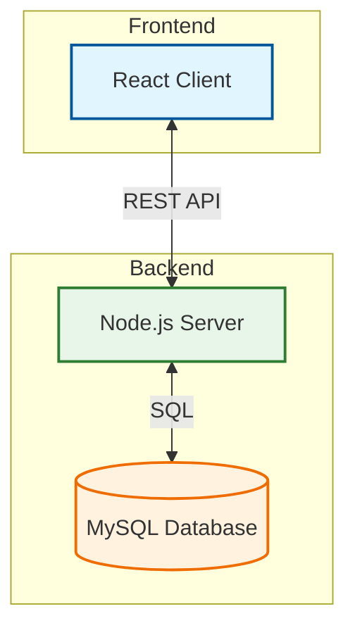
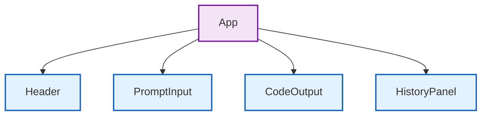
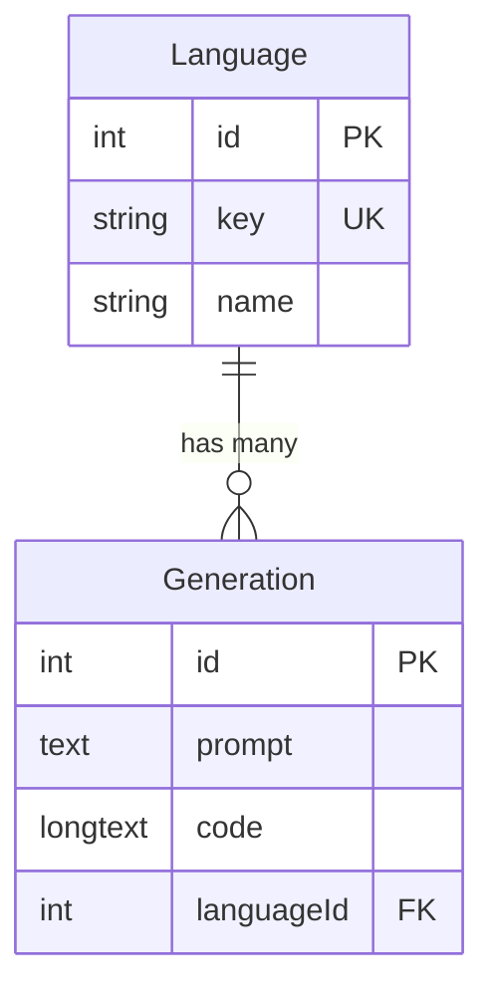

# Code Generation Copilot

A full-stack AI-powered code generation assistant. This application allows users to generate code snippets in various languages using a mock AI backend, view their generation history, and manage their workflow with a clean, modern UI.

## 🏗️ System Architecture



The application follows a classic client-server architecture:
- **Client (Frontend)**: A React Single Page Application (SPA) built with Vite. It handles user interactions, state management, and API calls.
- **Server (Backend)**: A Node.js/Express REST API that processes requests, handles business logic, and interacts with the database.
- **Database**: A MySQL relational database storing supported languages and generation history.

---

## 🎨 Frontend Deep Dive (`/client`)

The frontend is built for speed and interactivity using **React** and **Tailwind CSS**.

### Component Hierarchy



### Key Components

#### 1. `Header.jsx`
- **Purpose**: Navigation and global controls.
- **Features**:
    - **Logo**: Uses the `Code2` icon from `lucide-react` to represent the coding theme.
    - **Theme Toggle**: Switches between light and dark modes by toggling the `.dark` class on the `<html>` element.
    - **History Toggle**: Opens the history sidebar on mobile devices.
- **Styling**: Sticky positioning (`sticky top-0`) ensures it's always visible.

#### 2. `PromptInput.jsx`
- **Purpose**: The main interface for user input.
- **Features**:
    - **Text Area**: Auto-resizing input for natural language prompts.
    - **Language Selector**: Dropdown to choose the target programming language.
    - **Generate Button**: Triggers the API call to the backend.
- **State**: Manages `prompt` text and `selectedLanguage`.

#### 3. `CodeOutput.jsx`
- **Purpose**: Displays the generated code.
- **Features**:
    - **Syntax Highlighting**: Uses `react-syntax-highlighter` (Prism) for beautiful code coloring.
    - **Copy to Clipboard**: One-click copy functionality with visual feedback.
    - **Download**: Allows saving the snippet as a file.
    - **Theme Adaptation**: Dynamically switches syntax themes (`oneLight` / `oneDark`) based on the app's mode.

#### 4. `HistoryPanel.jsx`
- **Purpose**: Sidebar showing past generations.
- **Features**:
    - **Pagination**: "Load More" button to fetch older records.
    - **Filtering**: Filter history by language.
    - **Selection**: Clicking an item loads it back into the main view.

### Styling Strategy
- **Tailwind CSS**: Used for 99% of styling for rapid development and consistency.
- **CSS Variables**: Defined in `globals.css` for semantic color tokens (e.g., `--color-primary-bg`), enabling seamless dark mode support.
- **Lucide React**: Provides a consistent, clean icon set.

---

## ⚙️ Backend Deep Dive (`/server`)

The backend is a robust REST API built with **Node.js** and **Express**.

### Database Schema



### Data Models (`/server/src/models`)

#### 1. `Language`
- **Purpose**: Stores supported programming languages.
- **Fields**:
    - `id`: Primary Key.
    - `key`: Unique string identifier (e.g., "python", "javascript").
    - `name`: Display name (e.g., "Python", "JavaScript").
- **Why**: Normalizing languages prevents typos and allows for easy management of supported options.

#### 2. `Generation`
- **Purpose**: Stores every code generation request.
- **Fields**:
    - `id`: Primary Key.
    - `prompt`: The user's original request.
    - `code`: The generated response (stored as `LONGTEXT`).
    - `languageId`: Foreign Key linking to `Language`.
- **Relationships**: A `Language` has many `Generations`.

### API Routes (`/server/src/routes`)

#### `POST /api/generate`
- **Logic**:
    1.  Validates input (prompt and language).
    2.  Simulates AI delay (mock).
    3.  Generates code based on templates.
    4.  Saves the result to the `Generations` table.
- **Response**: Returns the generated code object.

#### `GET /api/history`
- **Logic**:
    1.  Accepts `page`, `limit`, and `language` query params.
    2.  Calculates `OFFSET` for pagination.
    3.  Queries `Generations` with a `JOIN` on `Language`.
- **Complexity**: Uses `OFFSET` pagination (O(offset + limit)).

#### `GET /api/languages`
- **Logic**: Returns all available languages from the database.

---

## 🛠️ Setup & Deployment

### Prerequisites
- Node.js (v18+)
- MySQL Server

### Installation

1.  **Clone the repository**
    ```bash
    git clone <repository-url>
    cd code-generation-copilot
    ```

2.  **Install Dependencies**
    Run the following command in the root directory to install dependencies for both client and server:
    ```bash
    npm run install:all
    ```

3.  **Database Setup**
    - Create a MySQL database (e.g., `code_copilot`).
    - Configure the environment variables in `server/.env`:
      ```env
      DB_NAME=code_copilot
      DB_USER=root
      DB_PASSWORD=your_password
      DB_HOST=localhost
      PORT=3001
      ```
    - Run migrations and seeders:
      ```bash
      cd server
      npx sequelize-cli db:migrate
      npx sequelize-cli db:seed:all
      ```

4.  **Run the Application**
    From the root directory, start both client and server:
    ```bash
    npm run dev
    ```
    - Frontend: http://localhost:5173
    - Backend: http://localhost:3001

---

## 🧠 Complexity Awareness

### What is the time complexity of paginated retrieval of generations?
The time complexity for the API endpoint is **O(limit)** for fetching the rows after the offset. However, the underlying SQL query uses `OFFSET` and `LIMIT`.
- **Database Query**: `SELECT * FROM Generations ORDER BY createdAt DESC LIMIT <limit> OFFSET <offset>`
- **Complexity**: In MySQL, `OFFSET` requires the engine to scan and discard the first `N` rows. Thus, the complexity is **O(offset + limit)**. As the page number increases (and thus the offset), the query becomes slower. For very large datasets, cursor-based pagination (using the last seen `id` or `createdAt`) would be more efficient (O(limit)).

### How does your schema affect query performance and flexibility?
- **Normalization**: Separating `Languages` into their own table reduces storage redundancy (we store the integer ID instead of the string "Python" repeatedly).
- **Flexibility**: Adding a new language is as simple as inserting a row into the `Languages` table; no schema migration is needed for the `Generations` table.
- **Performance**: Joins are required to fetch the language name with the generation, but since `id` is a primary key, this join is extremely fast (O(1) lookup).

### When are indexes useful? Did you create any?
Indexes are useful for columns that are frequently used in `WHERE`, `ORDER BY`, and `JOIN` clauses.
- **Created Indexes**:
    - **Primary Keys (`id`)**: Automatically indexed by MySQL (Clustered Index).
    - **Foreign Key (`languageId`)**: Indexed to optimize the JOIN operation between `Generations` and `Languages`.
    - **Unique Key (`Language.key`)**: Explicitly created via `unique: true` in the migration to ensure uniqueness and speed up lookups when filtering history by language.
